# ICT-FaceKit
ICT's Vision and Graphics Lab's morphable face model and toolkit

## ICT Face Model Light
The light version of the ICT Face Model consists of a base topology along with definitions of facial landmarks, rigid, and morphable vertices, and a set of linear shape vectors in the form of principal components of light stage scan data registered to a common topology.

ICT-FaceKit is released under the MIT license.

### Face Model Topology

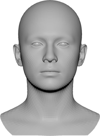
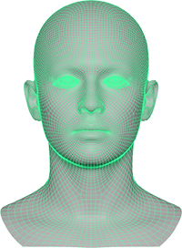
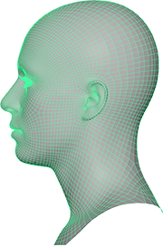

| Ordinal#| Geometry name        | Vertex indices | Polygon indices | #Vertices | #Faces |
|---------|----------------------|----------------|-----------------|-----------|--------|
| n/a     | All                  | [0:26718]      | [0:26383]       | 26719     | 26384  |
| #0      | Face                 | [0:9408]       | [0:9229]        | 9409      | 9230   |
| #1      | Head and Neck        | [9409:11247]   | [9230:11143]    | 1839      | 1914   |
| #2      | Eye socket left      | [11248:11631]  | [11144:11547]   | 384       | 404    |
| #3      | Eye socket right     | [11632:12015]  | [11548:11951]   | 384       | 404    |
| #4      | Mouth socket         | [12016:14061]  | [11952:14033]   | 2046      | 2082   |
| #5      | Gums and tongue      | [14062:17038]  | [14034:17005]   | 2977      | 2972   |
| #6      | Teeth                | [17039:21450]  | [17006:21495]   | 4412      | 4490   |
| #7      | Eyeball left         | [21451:23020]  | [21496:23093]   | 1570      | 1598   |
| #8      | Eyeball right        | [23021:24590]  | [23094:24691]   | 1570      | 1598   |
| #9      | Lacrimal fluid left  | [24591:24794]  | [24692:24854]   | 204       | 163    |
| #10     | Lacrimal fluid right | [24795:24998]  | [24855:25017]   | 204       | 163    |
| #11     | Eye blend left       | [24999:25022]  | [25018:25032]   | 24        | 15     |
| #12     | Eye blend right      | [25023:25046]  | [25033:25047]   | 24        | 15     |
| #13     | Eye occlusion left   | [25047:25198]  | [25048:25175]   | 152       | 128    |
| #14     | Eye occlusion right  | [25199:25350]  | [25176:25303]   | 152       | 128    |
| #15     | Eyelashes left       | [25351:26034]  | [25304:25843]   | 684       | 540    |
| #16     | Eyelashes right      | [26035:26718]  | [25844:26383]   | 684       | 540    |

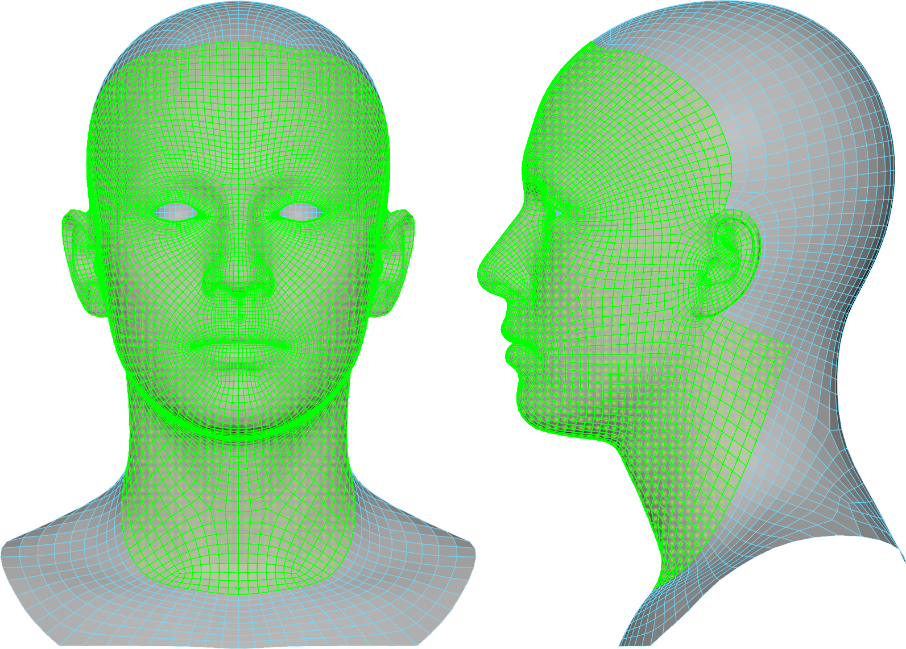
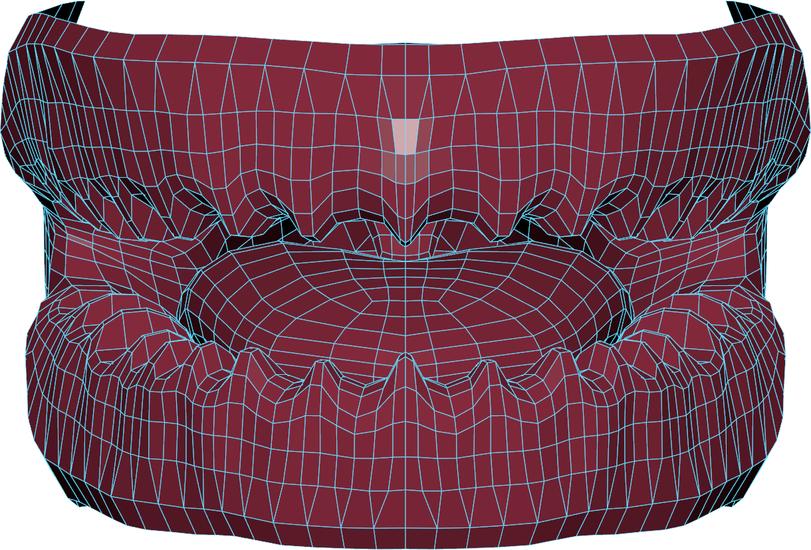
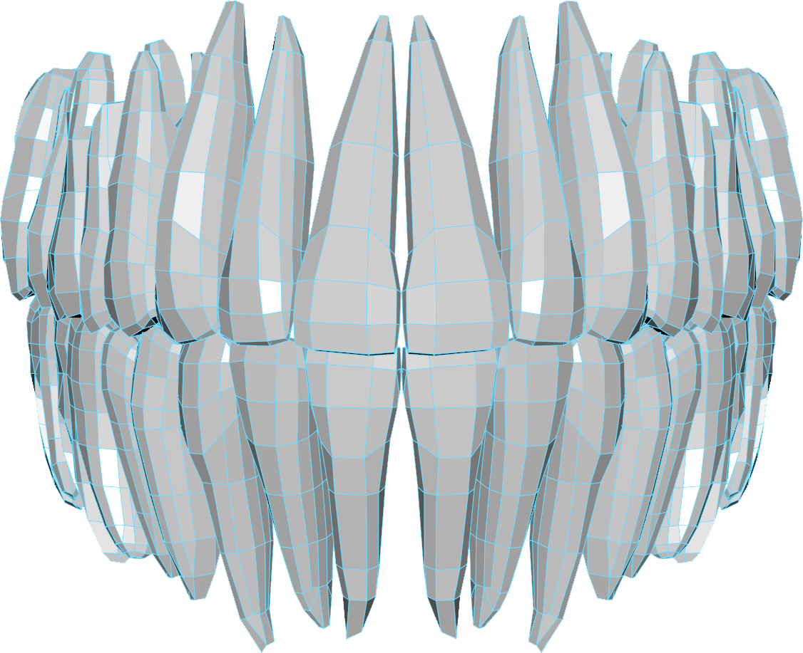

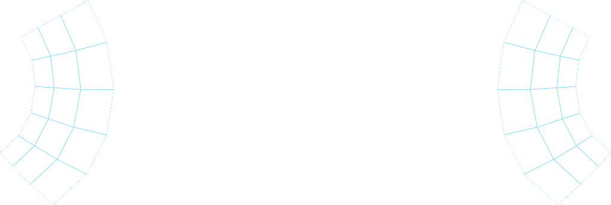

### UV Layout

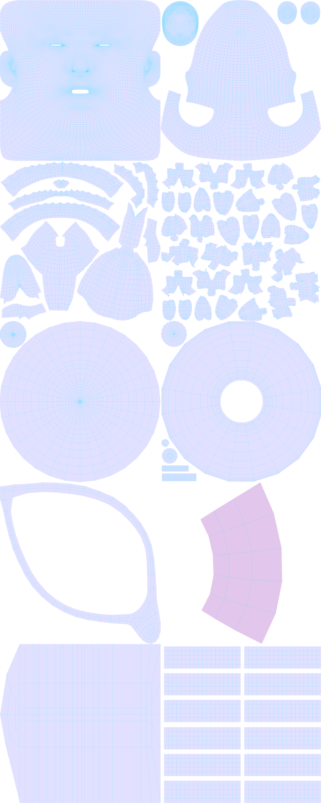

### Face Area Detail

| Ordinal#| Geometry name    | Vertex indices | Polygon indices | #Vertices | #Faces |
|---------|------------------|----------------|-----------------|-----------|--------|
| #0      | Full face area   | [0:9408]       | [0:9229]        | 9409      | 9230   |
| #1      | Narrow face area | [0:6705]       | [0:6559]        | 6706      | 6560   |

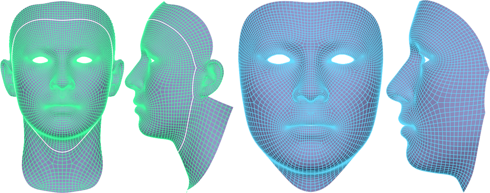

### Eyeball Details

| Ordinal#| Geometry name | Vertex indices | Polygon indices | #Vertices | #Faces |
|---------|---------------|----------------|-----------------|-----------|--------|
| #0      | Sclera left   | [21451:22220]  | [21496:22295]   | 770       | 800    |
| #1      | Iris left     | [22221:23020]  | [22296:23093]   | 800       | 798    |
| #2      | Sclera right  | [23021:23790]  | [23094:23893]   | 770       | 800    |
| #3      | Iris right    | [23791:24590]  | [23894:24691]   | 800       | 798    |

Additional eye geometry including lacrimal fluid, blend meshes, and occlusion meshes adopts the style of Unreal Engine's [Digital Human Project](https://docs.unrealengine.com/en-US/Resources/Showcases/DigitalHumans/index.html "Unreal Engine's Digital Human Project"). The existing geometries are plug and play with Unreal Engine's shaders.

### Teeth Details

| Ordinal# | Tooth name                  | Vertex indices | Polygon indices | #Vertices | #Faces |
|----------|-----------------------------|----------------|-----------------|-----------|--------|
| #0       | 3rd Molar upper left        | [17039:17229]  | [17006:17203]   | 191       | 198    |
| #1       | 2nd Molar upper left        | [17230:17415]  | [17204:17397]   | 186       | 194    |
| #2       | 1st Molar upper left        | [17416:17606]  | [17398:17592]   | 191       | 195    |
| #3       | 2nd Bicuspid upper left     | [17607:17729]  | [17593:17717]   | 123       | 125    |
| #4       | 1st Bicuspid upper left     | [17730:17894]  | [17718:17885]   | 165       | 168    |
| #5       | Canine upper left           | [17895:17990]  | [17886:17979]   | 96        | 94     |
| #6       | Lateral incisor upper left  | [17991:18066]  | [17980:18053]   | 76        | 74     |
| #7       | Central incisor upper left  | [18067:18142]  | [18054:18127]   | 76        | 74     |
| #8       | Central incisor upper right | [18143:18218]  | [18128:18201]   | 76        | 74     |
| #9       | Lateral incisor upper right | [18219:18294]  | [18202:18275]   | 76        | 74     |
| #10      | Canine upper right          | [18295:18390]  | [18276:18369]   | 96        | 94     |
| #11      | 1st Bicuspid upper right    | [18391:18555]  | [18370:18537]   | 165       | 168    |
| #12      | 2nd Bicuspid upper right    | [18556:18678]  | [18538:18662]   | 123       | 125    |
| #13      | 1st Molar upper right       | [18679:18869]  | [18663:18857]   | 191       | 195    |
| #14      | 2nd Molar upper right       | [18870:19055]  | [18858:19051]   | 186       | 194    |
| #15      | 3rd Molar upper right       | [19056:19246]  | [19052:19249]   | 191       | 198    |
| #16      | 3rd Molar lower left        | [19247:19425]  | [19250:19433]   | 179       | 184    |
| #17      | 2nd Molar lower left        | [19426:19601]  | [19434:19615]   | 176       | 182    |
| #18      | 1st Molar lower left        | [19602:19813]  | [19616:19831]   | 212       | 216    |
| #19      | 2nd Bicuspid lower left     | [19814:19951]  | [19832:19972]   | 138       | 141    |
| #20      | 1st Bicuspid lower left     | [19952:20078]  | [19973:20103]   | 127       | 131    |
| #21      | Canine lower left           | [20079:20168]  | [20104:20193]   | 90        | 90     |
| #22      | Lateral incisor lower left  | [20169:20262]  | [20194:20288]   | 94        | 95     |
| #23      | Central incisor lower left  | [20263:20348]  | [20289:20372]   | 86        | 84     |
| #24      | Central incisor lower right | [20349:20434]  | [20373:20456]   | 86        | 84     |
| #25      | Lateral incisor lower right | [20435:20528]  | [20457:20551]   | 94        | 95     |
| #26      | Canine lower right          | [20529:20618]  | [20552:20641]   | 90        | 90     |
| #27      | 1st Bicuspid lower right    | [20619:20745]  | [20642:20772]   | 127       | 131    |
| #28      | 2nd Bicuspid lower right    | [20746:20883]  | [20773:20913]   | 138       | 141    |
| #29      | 1st Molar lower right       | [20884:21095]  | [20914:21129]   | 212       | 216    |
| #30      | 2nd Molar lower right       | [21096:21271]  | [21130:21311]   | 176       | 182    |
| #31      | 3rd molar lower right       | [21272:21450]  | [21312:21495]   | 179       | 184    |

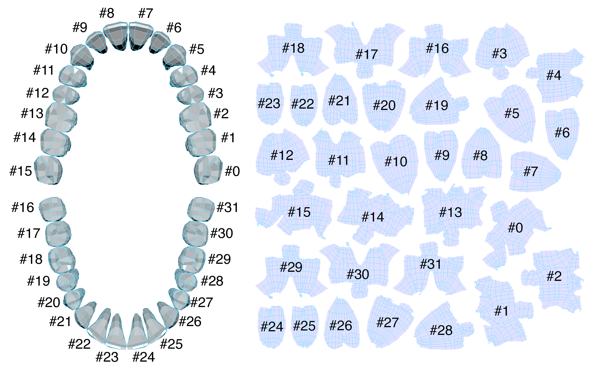

### Facial Landmarks

All the following indices are 0-indexed.

Multi-PIE 68 point facial landmarks indices:

    1225, 1888, 1052, 367, 1719, 1722, 2199, 1447, 966, 3661, 4390, 3927, 3924, 2608, 3272, 4088, 3443, 268, 493, 1914, 2044, 1401, 3615, 4240, 4114, 2734, 2509, 978, 4527, 4942, 4857, 1140, 2075, 1147, 4269, 3360, 1507, 1542, 1537, 1528, 1518, 1511, 3742, 3751, 3756, 3721, 3725, 3732, 5708, 5695, 2081, 0, 4275, 6200, 6213, 6346, 6461, 5518, 5957, 5841, 5702, 5711, 5533, 6216, 6207, 6470, 5517, 5966

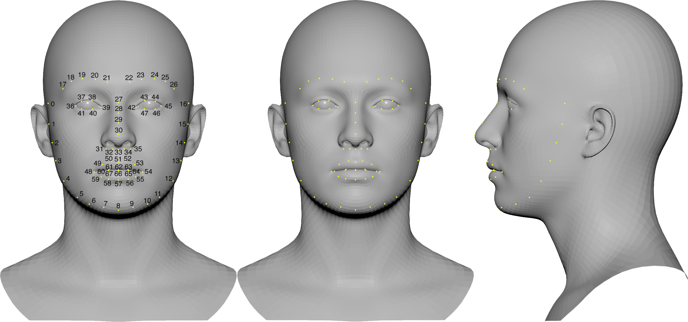

Right jawline (substitutes 0-7 in Multi PIE):

    1278, 1272, 12, 1834, 243, 781, 2199, 1447

Left jawline (substitutes 9-16 in Multi PIE):

    3661, 4390, 3022, 2484, 4036, 2253, 3490, 3496

Right extended jawline (superset of right jawline):

    1280, 1278, 1275, 1272, 1248, 12, 820, 1834, 1902, 243, 844, 781, 1673, 2199, 801, 1447, 800

Left extended jawline (superset of left jawline):

    3041, 3661, 3042, 4390, 3880, 3022, 3085, 2484, 4102, 4036, 3061, 2253, 3466, 3490, 3493, 3496, 3498

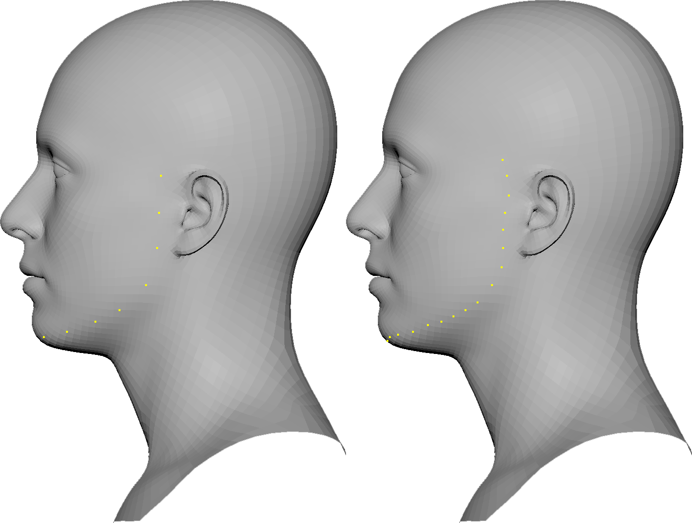

### Identity shape vectors

The non-commercial model includes a set of 100 PCA modes of linear morph targets. The linear morphing affects the full geometry of the face model and is based on light stage facial scan data.

"What is a Linear 3D Morphable Face Model?" (Youtube link):

### Expression Shapes

Current expression shapes adapt the naming convention of the Apple ARKit. Expression shapes and naming convention are subject to change.

## Full ICT Face Model

More info to come

## Publications

### Learning Formation of Physically Based Face Attributes
CVPR 2020 : IEEE/CVF Conference on Computer Vision and Pattern Recognition

#### Abstract
Based on a combined data set of 4000 high resolution facial scans, we introduce a non-linear morphable face model, capable of producing multifarious face geometry of pore-level resolution, coupled with material attributes for use in physically-based rendering.
We aim to maximize the variety of the participants' face identities, while increasing the robustness of correspondence between unique components, including middle-frequency geometry, albedo maps, specular intensity maps and high-frequency displacement details. Our deep learning based generative model learns to correlate albedo and geometry, which ensures the anatomical correctness of the generated assets. We demonstrate potential use of our generative model for novel identity generation, model fitting, interpolation, animation, high fidelity data visualization, and low-to-high resolution data domain transferring. We hope the release of this generative model will encourage further cooperation between all graphics, vision, and data focused professionals, while demonstrating the cumulative value of every individual's complete biometric profile.

#### Citing
BibTex:

    @misc{li2020learning,
    title={Learning Formation of Physically-Based Face Attributes},
    author={Ruilong Li and Karl Bladin and Yajie Zhao and Chinmay Chinara and Owen Ingraham and Pengda Xiang and Xinglei Ren and Pratusha Prasad and Bipin Kishore and Jun Xing and Hao Li},
    year={2020},
    eprint={2004.03458},
    archivePrefix={arXiv},
    primaryClass={cs.CV}
    }
